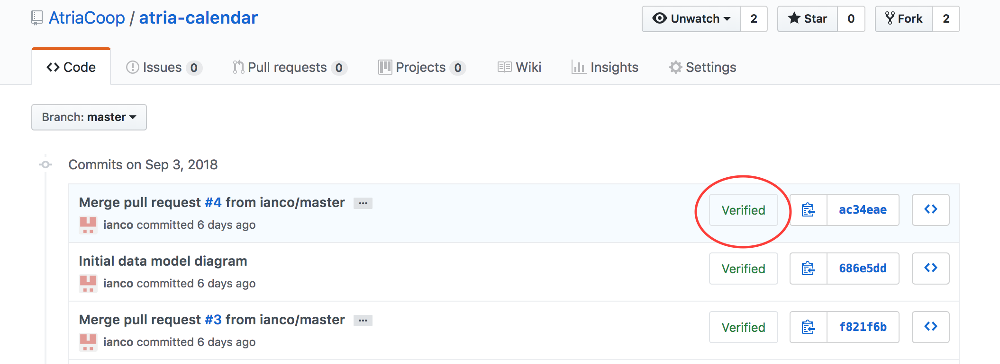
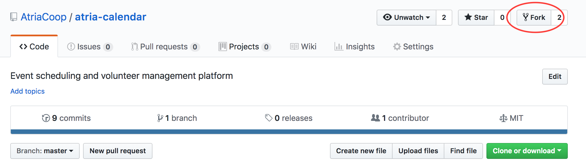
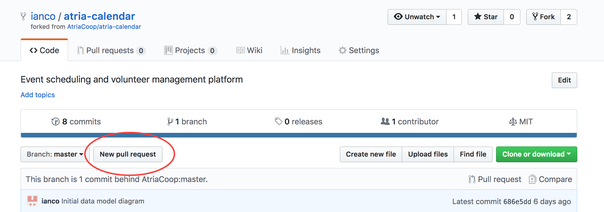

# Contributing

If you would like to contribute to the Atria Calendar, or other Atria projects, please read the following contribution guidelines.

## Signing commits

Atria requires commits to be "signed" - this provides assurances that the developer named on the commit is the one who actually committed the code.  Signed commits show up in the github history log with a green "Verified" badge:



Please review the following links to setup a gpg key linked to your github account:

* See:  https://help.github.com/articles/signing-commits-with-gpg/
* Setup a GPG key:  https://help.github.com/articles/generating-a-new-gpg-key/
* Add the new GPG key to your GitHub account:  https://help.github.com/articles/adding-a-new-gpg-key-to-your-github-account/
* Add to git:  https://help.github.com/articles/telling-git-about-your-gpg-key/
* Sign your commits using GPG:  https://help.github.com/articles/signing-commits-using-gpg/

Note - to sign your commits, remember to include ""-S" in your git commit command:

```
git commit -S -m "This is a sample signed commit"
```

## Fork Atria Repository

When doing development, you will work in a local copy of the Atria repository, and then submit updates using "Pull Requests".

To create your local fork of the repository, navigate to the Atria repository in your browser, and click on the "Fork" button in the top right corner:



This will create a copy of the repository under your own github account.  You can then check out the code, work locally, and commit code independent of the Atria repository.

To keep your local code up to date with the parent, first link your local repo with the parent:

```
cd atria-calendar
git remote add upstream https://github.com/AtriaCoop/atria-calendar.git
git remote -v
```

... and then periodically synchronize parent updates into your local:

```
git fetch upstream
git merge upstream/master
git push
```

## Make changes (commit with "-S")

Work in your local repository, and remember to sign your commits:

```
git commit -S -m "Some message about the change"
```

If you are working on multiple separate features, create a separate branch for each feature.  Remember that when submitting a Pull Request (described next), all code in the branch is included.  The only way to support multiple concurrent Pull Requests is to base each PR off a separate branch.

## Submit Updates using Pull Requests

When you are ready to submit updates, create a Pull Request to the parent repository.

To submit a Pull Request to the parent Atria repository, click on the "New pull request" button on your own github repository page:



## Unit Tests

All code must include unit tests, description t.b.d.

## Documentation

Relevant documentation must be updates, description t.b.d.
