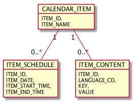

# Atria Calendar Design

## Calendar Data Model

The Atria calendar provides basic storage for an event, it's attributes, schedule, and content, which can be stored in multiple languages.

Table CALENDAR_EVENT: core record for each event:

| Column | Description |
| ------ | ----------- |
| ITEM_ID | Internal item identifier |
| ITEM_NAME | Descriptive name to identify the event (not displayed in the calendar) |

Table ITEM_SCHEDULE: calendar schedule for the event, one record for each occurrence:

| Column | Description |
| ------ | ----------- |
| ITEM_ID | Reference to the calendar item |
| ITEM_DATE | Date of the occurrence |
| ITEM_START_TIME | Start time of the occurrence |
| ITEM_END_TIME | End time of the occurrence |

Table ITEM_CONTENT: language-specific content to display within the calendar for each item:

| Column | Description |
| ------ | ----------- |
| ITEM_ID | Reference to the calendar item |
| LANGUAGE_CD | Language of the content |
| KEY | Attribute name (each attribute should have a record for each language) |
| VALUE | Language-specific value to display in the calendar |
